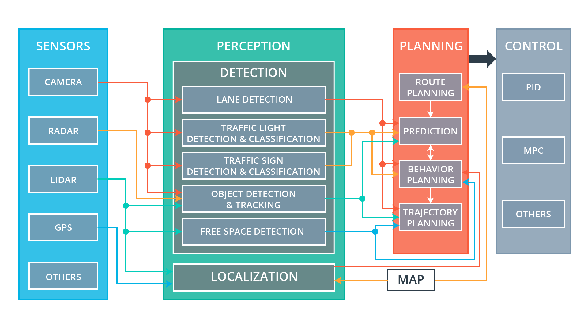

# Self driving car system integration project
## Implemented by Team (final_project)

#### Dec <>, 2017

# Objective

The objective of the project is to control CARLAs throttle, steering and brakes to navigate map waypoints to successfully drive the car on a highway. The car is expected to follow lanes, traffic lights and objects and plan a trajectory to follow based on the waypoints. The car should be able to classify “Red”, “Green”, and “Yellow” lights and be able to stop/start/slow down based on the traffic signal.
Before running our code on CARLA we are developing the code to work in a simulator. 
The simulator works in a very similar way to CARLA as all ROS nodes and topics are same. So if our system works in the simulator, we expect that it should also work on CARLA. 

# The system architecture and principles behind it

The system architecture consists of the following modules:

## Perception

Traffic light detection - We used a deep neural net to detect if the upcoming traffic light is red or not. We trained the classifier once with images from the simulator and once with real images from the ROS bag. A detailed description of the architecture and training parameters can be found in the respective section below (under additional resources implemented) 
We employed the MobileNet architecture to efficiently detect / classify traffic lights. We applied transfer learning … and implemented on two modes as follows: 
•	Simulator mode: classifies whole images as either red/green/yellow. The model was trained with several datasets using the Tensorflow Image Retraining Example 
•	Test-site mode: we employed <> framework to locate a traffic light… 

## Planning
The waypoint updater node publishes a queue of n waypoints ahead of the vehicle position, each with a target velocity. For the simulator, n=100 is sufficient.  We dequeue traversed waypoints and enqueue new points, preserving and reusing those in the middle. When a light-state changes, the entire queue is updated. The vehicle stops at the final base waypoint. This module is performed using the ROS Package Waypoint updater which is explained as below:
o	Waypoint Updater - sets target velocity for each waypoint based on upcoming traffic lights and obstacles.  This node subscribed to the nodes /base_waypoints, /current_pose, /obstacle_waypoint, and /traffic_waypoint topics, and published a list of waypoints ahead of the car with target velocities to the /final_waypoints topic.

## Control subsystems

The control subsystem is implemented using the ROS Package drive-by-wire which adjusts throttle and brakes according to the velocity targets published by the waypoint follower (which is informed by the waypoint updater node). If the list of waypoints contains a series of descending velocity targets, the PID velocity controller (in the twist controller component of DBW) will attempt to match the target velocity
o	DBW (Drive by Wire) - takes target trajectory information as input and sends control commands to navigate the vehicle.  The dbw_node subscribes to the /current_velocity topic along with the /twist_cmd topic to receive target linear and angular velocities. Additionally, this node subscribes to /vehicle/dbw_enabled, which indicates if the car is under dbw or driver control. This node will publish throttle, brake, and steering commands to the /vehicle/throttle_cmd, /vehicle/brake_cmd, and /vehicle/steering_cmd topics.



## Implementation Nodes

The diagram below illustrates the system architecture. The autonomous vehicle controller is composed of three major units: perception, planning, and control.


  
  a: /camera/image_raw
  b: /current_pose
  c: /current_velocity
  d: /vehicle/dbw_enabled
  e: /traffic_waypoint
  f: /base_waypoints
  g: /final_waypoints
  h: /twist_cmd
  i: /vehicle/throttle_cmd
  j: /vehicle/brake_cmd
  k: /vehicle/steering_cmd

# Operation

There are three modes in which the controller operates:
•	site: When at the test site, this mode is launched. This mode can be run simultaneously with a rosbag to test the traffic light     classifier
•	sitesim: emulates the test site in the simulator at the first traffic light
•	styx: When using the term3 simulator, this mode is launched. The simulator communicates through server.py and bridge.py
These modes are started by roslaunch. For example, to run the styx (simulator) version we run:
roslaunch launch/styx.launch

# Team


# Results

•	Video from the dash camera onboard the test vehicle:
•	Point cloud visualization:  
•	A map of the test run can be found at <>
•	Log file, ROS bag, and feedback:  
  
# Additional Resources Implemented

## Traffic Light Image Classification

The perception subsystem dynamically classifies the color of traffic lights in front of the vehicle. In the given simulator and test site environment, the car faces a single traffic light or a set of 3 traffic lights in the same state (green, yellow, red). We assume it is not possible to have multiple traffic lights in the different states at the same time.
We have considered classifying the entire image using CNN approach to solve the traffic light classification task. We used different set of models and got the following results <>

## Dataset

There are multiple datasets, available for model training:
•	images from the Udacity Simulator (images as well as the ground truth from the frontal camera are available as a ROS topic);
https://drive.google.com/open?id=0Bw5abyXVejvMci03bFRueWVXX1U
•	rosbag, captured on the Udacity's test site;
https://drive.google.com/file/d/0B2_h37bMVw3iYkdJTlRSUlJIamM/view

## Image Preprocessing

On the image pre-processing step we've applied multiple visual transformations:
•	 
•	 
•	 
•	 

## Neural Network Model

## Accuracy on the simulator data

# Waypoint Updater

## Implementation

Waypoint updater publishes a queue of n waypoints ahead of the vehicle position, each with a target velocity. For the simulator, n=100 should be sufficient. For the site (the real-world test track), we'll need n=20. We can dequeue traversed waypoints and enqueue new points, preserving and reusing those in the middle. When a light-state changes, the entire queue may need updating. The vehicle should stop at the final base waypoint in the simulator (the default provided by the waypoint loader). This is overridden for the test-site, enabling the vehicle to loop around the track repeatedly.
Initialization of queue:
•	Create a persisted queue
•	Locate closest waypoint (in the base waypoint list) ahead of current position of vehicle and enqueued n waypoints.
•	Persist the index of the last retrieved point in the base list.
Operation cycle at a frequency of 2 Hz:

Operation cycle at a frequency of 10 Hz:

•	Manage waypoint queue: Dequeue consumed waypoints with coordinates "behind" the current vehicle position. Enqueue waypoints from base list starting from last until queue is restored to n in length. (Unless final is encountered).
•	Update velocity: If red/yellow light NOT within range (4 m for site, 62 m for simulator), set waypoint velocity to defaults (10 km/h for site, 40 km/h for simulator) given in base list. If red/yellow within range, update each waypoint velocity so that the vehicle comes to a halt at the stop-line waypoint. Decrease velocity at a constant rate of -1.0 m/s2. Velocity beyond the stop line should be set to zero.

## Optimization

As the vehicle moved along a path, the waypoint updater made changes to the planned path. 

An optimized updater is important to the Drive-By-Wire node because it will reduce unnecessary accelerations due to plan changes. For instance, when the vehicle is approaching a red traffic light, a ramp down in velocity is planned. If the one plan is followed, the acceleration will be smoothly executed. On the other hand, if the updater replans too frequently, and because the vehicle is in a new location, a new velocity ramp is created. This leads to interruptions in the deceleration plan to the stop line. 

# Drive By Wire

## Velocity Targets (Stepped)

The drive-by-wire node adjusts throttle and brakes according to the velocity targets published by the waypoint follower (which is informed by the waypoint updater node). If the list of waypoints contains a series of descending velocity targets, the PID velocity controller (in the twist controller component of DBW) will attempt to match the target velocity. 


# The original readme from Udacity

This is the project repo for the final project of the Udacity Self-Driving Car Nanodegree: Programming a Real Self-Driving Car. For more information about the project, see the project introduction [here](https://classroom.udacity.com/nanodegrees/nd013/parts/6047fe34-d93c-4f50-8336-b70ef10cb4b2/modules/e1a23b06-329a-4684-a717-ad476f0d8dff/lessons/462c933d-9f24-42d3-8bdc-a08a5fc866e4/concepts/5ab4b122-83e6-436d-850f-9f4d26627fd9).


### Native Installation

* Be sure that your workstation is running Ubuntu 16.04 Xenial Xerus or Ubuntu 14.04 Trusty Tahir. [Ubuntu downloads can be found here](https://www.ubuntu.com/download/desktop).
* If using a Virtual Machine to install Ubuntu, use the following configuration as minimum:
  * 2 CPU
  * 2 GB system memory
  * 25 GB of free hard drive space

  The Udacity provided virtual machine has ROS and Dataspeed DBW already installed, so you can skip the next two steps if you are using this.

* Follow these instructions to install ROS
  * [ROS Kinetic](http://wiki.ros.org/kinetic/Installation/Ubuntu) if you have Ubuntu 16.04.
  * [ROS Indigo](http://wiki.ros.org/indigo/Installation/Ubuntu) if you have Ubuntu 14.04.
* [Dataspeed DBW](https://bitbucket.org/DataspeedInc/dbw_mkz_ros)
  * Use this option to install the SDK on a workstation that already has ROS installed: [One Line SDK Install (binary)](https://bitbucket.org/DataspeedInc/dbw_mkz_ros/src/81e63fcc335d7b64139d7482017d6a97b405e250/ROS_SETUP.md?fileviewer=file-view-default)
* Download the [Udacity Simulator](https://github.com/udacity/CarND-Capstone/releases).

### Docker Installation
[Install Docker](https://docs.docker.com/engine/installation/)

Build the docker container
```bash
docker build . -t capstone
```

Run the docker file
```bash
docker run -p 4567:4567 -v $PWD:/capstone -v /tmp/log:/root/.ros/ --rm -it capstone
```

### Usage

1. Clone the project repository
```bash
git clone https://github.com/udacity/CarND-Capstone.git
```

2. Install python dependencies
```bash
cd CarND-Capstone
pip install -r requirements.txt
```
3. Make and run styx
```bash
cd ros
catkin_make
source devel/setup.sh
roslaunch launch/styx.launch
```
4. Run the simulator

### Real world testing
1. Download [training bag](https://drive.google.com/file/d/0B2_h37bMVw3iYkdJTlRSUlJIamM/view?usp=sharing) that was recorded on the Udacity self-driving car (a bag demonstraing the correct predictions in autonomous mode can be found [here](https://drive.google.com/open?id=0B2_h37bMVw3iT0ZEdlF4N01QbHc))
2. Unzip the file
```bash
unzip traffic_light_bag_files.zip
```
3. Play the bag file
```bash
rosbag play -l traffic_light_bag_files/loop_with_traffic_light.bag
```
4. Launch your project in site mode
```bash
cd CarND-Capstone/ros
roslaunch launch/site.launch
```
5. Confirm that traffic light detection works on real life images
